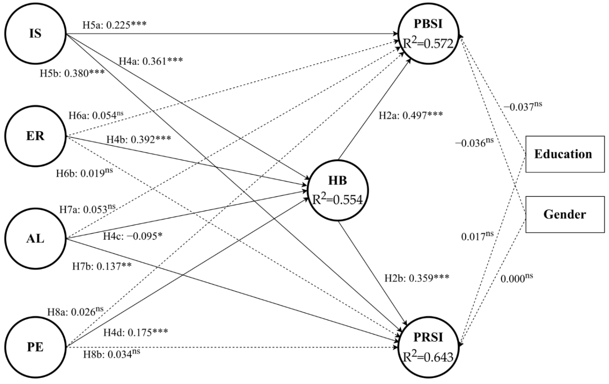

Lv, H., Cao, X., Chen, S., & Liu, L. (2022). Public and Private Information Sharing under “New Normal” of COVID-19: Understanding the Roles of Habit and Outcome Expectation. International Journal of Environmental Research and Public Health, 19(9), 5552.

<!--more-->

## 1 研究摘要

在COVID-19流行期间，**信息共享**在风险沟通和管理中至关重要，并且信息共享已成为**COVID-19“新常态”**下个人预防和特定生活方式的一部分。因此，本研究的目的是探索在常规风险情况下公共和私人信息共享意愿的影响因素和机制。本研究基于横断面设计调查了一个信息共享机制。

我们通过在线问卷平台的样本数据库收集了780个有效回答，并利用**偏最小二乘结构方程建模(PLS-SEM)**进一步分析数据。为了探究新闻框架造成的差异，我们根据新闻框架(行动框架vs.安抚框架)将受访者分为两组，并进行**多群组分析**。结果表明，四种结果期望(信息寻求、情绪调节、利他主义和公共参与)和习惯对公共和私人信息共享意愿产生了影响。

### 1.1 研究结果


本研究提出的两条影响信息共享的路径得到了支持。结果表明，结果期望与习惯呈正相关，这意味着认知机制与习惯形成正相关。**习惯在结果期望和信息共享之间起到了中介作用**。本研究发现，情绪调节和公共参与结果期望只影响了由习惯中介的两种信息共享意愿。关于新闻框架的作用，本研究发现，暴露于行动框架新闻的组和暴露于安抚框架新闻的组之间没有显著差异。


通过探索“新常态”下信息共享的影响因素和机制，这些发现有助于理解信息共享，并对风险管理产生影响。本研究提出的分类公共和私人信息共享的机制通过考虑在线风险孵化来补充风险信息流动。

## 2 研究方法

基于**横断面设计**，本研究探讨了在常规COVID-19预防下信息分享意图的机制。在选择中国大陆而非整个中国的原因之一是**中国大陆**采取常规预防策略来应对动态流行病，这与中国其他地区不同。同时，微博是中国大陆广泛使用的社交媒体平台之一，因此仅在中国大陆进行研究是合适的。我们根据受访者接触到的**新闻框架**（即，安抚型新闻与行动型新闻）将受访者分为两组，并检查了他们之间信息分享意图的差异。

## 3 研究模型

## 4 研究结论

**本研究旨在探讨在中国大陆突发性和规律性风险情况下影响信息共享意愿的因素和机制**。研究中包括了新闻框架，即信息特征，以比较可能引起的差异。在分析两组780名受访者的数据后，我们发现安抚和行动框架对信息共享意愿的机制没有影响。这表明，由于个体长期风险暴露和习惯性预防，新闻框架的作用并不像预期的那么重要。结果期望和习惯影响了公共和私人信息共享意愿，而习惯在结果期望和共享意愿之间起到了中介作用。研究表明，有意识的认知因素和习惯等无意识因素都会影响个体行为意愿。信息共享意愿背后有两个系统。

此外，**重复的认知过程系统可以促进稳定习惯的形成。后者指的是一条启发式路径**。这些发现表明，在没有直接高风险经验的人群中进行风险沟通时应考虑紧急情况的规范化。由风险带来的个体信息行为变化可以作为一种习惯保留下来，这值得进一步探索以更好地管理风险。更重要的是，这些发现展示了公共和私人信息共享的影响因素和机制。**私人信息共享可以被视为在线风险孵化的一部分，它补充了公共信息共享**。通过对信息共享进行分类，本研究扩展了对风险信息流的理解。


我们鼓励未来研究朝**三个方向**发展。
首先，有必要**测量个体信息共享行为**，以更精确地解释该过程，从而为该模型提供更强有力的证据。
其次，如前所述，本研究中的**两个新闻框架对信息共享机制没有显著影响**。然而，在风险沟通中不能忽视新闻框架的影响，因此需要在不同阶段的风险情况下进行更多研究。
最后，进一步研究应检验信息共享意愿模型在分类风险情况和**多元化群体**中的应用可能性。
