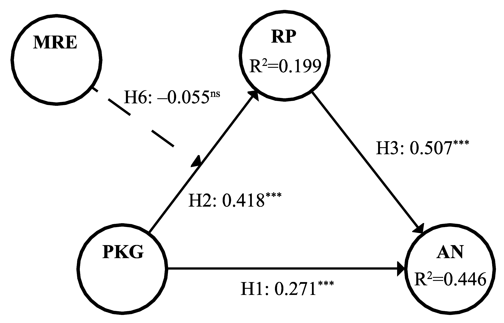

Li, K., Cao, X., He, Z., & Liu, L. (2022, January). The Effect of Experience on Anxiety in Food Safety Incidents—An Empirical Study on Infant Formula Safety Incidents in China. In Healthcare (Vol. 10, No. 1, p. 138). MDPI.

<!--more-->

## 1 Abstract

Infant formula incidents have endangered the dietary safety and healthy growth of infants and young children and are triggers of the public’s negative emotions, attracting widespread public attention. The aim of this research was to explore how perceived knowledge gap, risk perception, past actual risk experience, and media risk experience affect anxiety. The research data obtained from 506 respondents were divided into groups with actual risk experience and without actual risk experience. Then, PLS-SEM was used to analyze the data. The results show that risk perception mediated the relationship between perceived knowledge gap and anxiety. Specifically, for the group with actual risk experience, perceived knowledge gap had a significant direct impact on anxiety; however, there was no moderation effect of media experience on the relationship between perceived knowledge gap and risk perception. For the group without actual risk experience, perceived knowledge gap had no direct effect on anxiety, and media experience had a significant moderating effect on the relationship between perceived knowledge gap and risk perception. 

### 1.1 Results 


The results suggest that in infant formula safety incidents, actual risk experience and media risk experience have different influence mechanisms on anxiety. Actual risk experience will directly and intuitively bridge the relationship between perceived knowledge gap and anxiety. Meanwhile, groups without actual risk experience tend to be influenced by rational risk judgment, and this process is moderated by media risk experience.


## 2 Method

Based on a cross-sectional design, this study explored the effects of infant formula safety experience on the generation of individual anxiety in mainland China and examined the differences between groups with actual risk experience and without actual risk experience through group comparisons. This research was approved and managed by the academic ethics committee.

## 3 Model

## 4 Conclusion

The effects of perceived knowledge gap, risk perception, media risk experience, and actual risk experience on public anxiety in infant formula safety incidents were explored in this study. The results obtained from the data analysis of 506 questionnaires show that for the group without actual risk experience, perceived knowledge gap positively influenced risk perception, and risk perception had positive effects on anxiety, while risk perception played a complete mediating role, and media risk experience played a weakening moderating role in the impact of perceived knowledge gap on risk perception. For the group with actual risk experience, risk perception had a complementary mediation effect in the effect of perceived knowledge gap on anxiety, and the moderating effect of media risk experience was insignificant. 

This suggests that the overall perceived knowledge gap affects anxiety through the mediation effect of risk perception. However, the actual risk experience will bridge the relationship between perceived knowledge gap and anxiety, and this path may be heuristic and will replace the role of media risk experience.


We encourage future research efforts to channel into three directions. 

First of all, the model in this study was established based on infant formula safety incidents; however, the generalization and application scope of the model should take more contexts into consideration and be validated in future study. 

Second, in view of the first research limitation mentioned above, it could be worthwhile to investigate whether there is a difference in reaction speed between groups with and without actual risk experience in food safety incidents, and whether there is a difference in the cycle of social emotions through longitudinal research. 

Lastly, as mentioned earlier, reducing the intensity and influence of anxiety is inseparable from the support of media reports. However, the form of reporting (such as different narrative frameworks and different information release strategies) can effectively reduce the impact of perceived knowledge gap, risk perception, and media risk experience on anxiety, which is worthy of further research and discussion.

