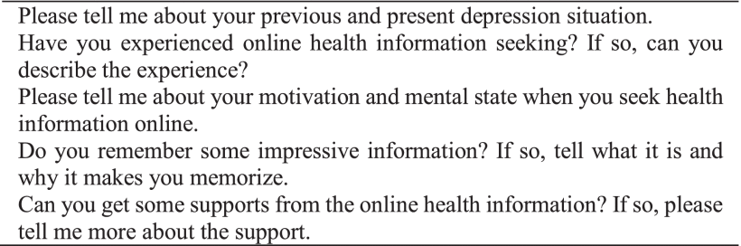

Cao, Xueyan, Xingbin Chao, and Liqun Liu. "Why do people suffering from depression seek online health information: An exploratory study." 2021 International Conference on Culture-oriented Science & Technology (ICCST). IEEE, 2021.

<!--more-->

## 1 Abstract

The number of people with depression around the world is increasing dramatically. Due to the role that online health information plays in depressive people’s treatment, health information-seeking of people suffering from depression has become a vital issue. This study explores the motivation of online health information-seeking among depressed people to explain behaviors further. A qualitative method was designed in this study; semi-structured interviews and thematic analysis were conducted with participants (n=21) suffering from depression self-reportedly. 

### 1.1 Results 


Results provide five motivations, reflecting causes of online health information-seeking behaviors: (1)React to abnormal physical appearance; (2)Assess oneself; (3)Obtain support; (4)Manage impression; (5)Avoid negative information. The study concludes a basic motivation model that motivates online health information seeking among depressed people, improving understanding of the behaviors. This model can broaden research on depression people and others with mental disorders. 


A direction that makes online information platforms friendly is also proposed in the study. To sum up, the finding of this study offers some significant contributions to theoretical and realistic progress.

## 2 Method

The semi-structured individual interviews that last 30-60 minutes were conducted informally over the telephone or online chatting platform to collect qualitative materials. A significant advantage of the individual interview is that the willingness of participants’ expression increases. Before beginning the interview, researchers briefly introduced the research purpose and related terminology to make participants more engaging. 

## 3 Interview questions

## 4 Conclusion

In all, this study has evaluated why people suffering from depression seek online health information, developing an exploratory motivation model for depressed people. This study extends the knowledge of health information seeking in patients with mental illness from the level of motivation. The model can contribute to constructing online health information for minority groups with mental disorders in practical applications. Further studies need to be carried out to validate the model and contribute to development in the relevant areas.


These results provide some support for understanding the nature of online health information-seeking behaviors among depressed people. However, the results are limited to generalize all the depression or mental disorders groups due to the small sample size. 

Besides, researchers combined the self-report of depression with interview information rather than the validated professional medical measure to select the participant. So there is ample room for further progress in evaluating health information-seeking behaviors under the guidance of experts.
