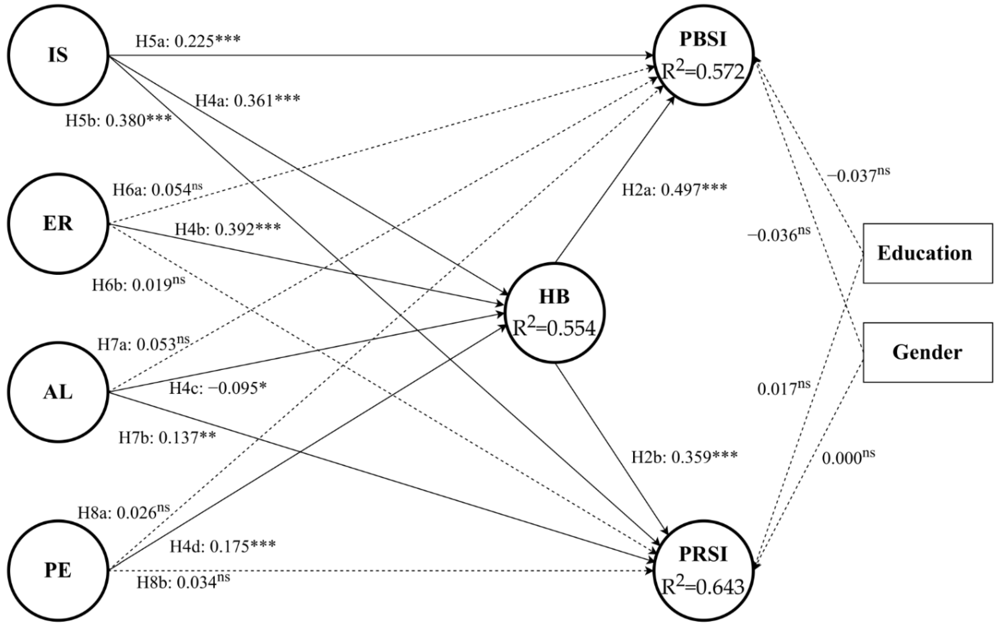

Lv, H., Cao, X., Chen, S., & Liu, L. (2022). Public and Private Information Sharing under “New Normal” of COVID-19: Understanding the Roles of Habit and Outcome Expectation. International Journal of Environmental Research and Public Health, 19(9), 5552.

<!--more-->

## 1 Abstract

**Information sharing** is critical in risk communication and management during the COVID-19 epidemic, and information sharing has been a part of individual prevention and particular lifestyles under **the “New Normal” of COVID-19**. Thus, the purpose of this study was to explore influencing factors and mechanisms in public and private information sharing intention among people under the regular risk situation. This study investigated an information sharing mechanism based on a cross-sectional design. We collected 780 valid responses through a sample database of an online questionnaire platform and utilized **partial least squares structural equation modeling (PLS-SEM)** to further analyze the data. To explore the difference caused by news frames, we divided respondents into two groups according to the news frame (action frame vs. reassurance frame) and proceeded with the **Multi-group analysis**. 

### 1.1 Results 


The results showed that four types of outcome expectations (information seeking, emotion regulation, altruism and public engagement) and habit had impacts on public and private information sharing intention. Two paths influencing information sharing proposed in this study were supported. The results showed that outcome expectations were positively related to habit, which implies that the cognitive mechanism was positively relevant to the formation of habit. **The results proved that habit played a mediating role between outcome expectations and information sharing**. This research found that emotion regulation and public engagement outcome expectations only affected two types of information sharing intention mediated by habit. Regarding the role of the news frame, this study found no significant difference between the group exposed to action-framed news and the group exposed to reassurance-framed news. 


By exploring influencing factors and the mechanism of information sharing under the “New Normal”, these findings contribute to understanding of information sharing and have implications on risk management. The proposed mechanism classifying public and private information sharing complements risk information flowing by considering online risk incubation.

## 2 Method

Based on **a cross-sectional design**, this study explored the mechanism of information sharing intention under regular COVID-19 prevention. Among the reasons for selecting **mainland China** instead of the whole of China is that mainland China adopts regular prevention strategies to deal with the dynamic epidemic, which differs from Chinese other regions. Meanwhile, Weibo is one of widely used social media platforms in mainland China so that conducting the study only in mainland China is suitable. We divided respondents into two groups based on **the character of news** they were exposed to (i.e., reassurance-framed news vs. action-framed news) and examined the difference in information sharing intention between them. The research was approved and managed by the Academic Ethics Committee.

## 3 Model

## 4 Conclusion

T**his study set out to explore influencing factors and the mechanism of information sharing intention under risk conditions with suddenness and regularity in mainland China.** News frames, the information feature, were included in the research to compare the possible differences they cause. After analyzing the data from 780 respondents in two groups, we found that reassurance and action frames had no impact on the mechanism of information sharing intention. This suggests that the role of news frames was not as significant as expected due to individual long-term risk exposure and habitual prevention. Outcome expectations and habit affected public and private information sharing intention while habit played a mediating role between outcome expectations and sharing intention. It was shown that both conscious cognitive factors and unconscious factors such as habit impact individual behavioral intention. There are two systems behind information sharing intention. 

In addition, **the repeated cognitive process system can contribute to the formation of stable habits.** The latter refers to a heuristic path. These findings suggest that the regularization of emergencies should be taken into consideration in risk communication among people who don’t have direct high-risk experience. A change of individual information behaviors brought by risks can be preserved as a habit, which deserves further exploration to better manage risk. More importantly, these findings demonstrate influencing factors and mechanisms in public and private information sharing. **Private information sharing can be seen as a part of online risk incubation, which complements public information sharing.** By classifying information sharing, this study expands the understanding of risk information flow.


We encourage future research in **three directions**. 
First, it is necessary to **measure individual information sharing behaviors** to explain the process more precisely, which can provide more robust evidence for this model. 
Second, as mentioned earlier, **two news frames in this study had no significant impact on information sharing mechanism**. However, the effect of news frames cannot be ignored in risk communication, so this needs more research in the different phases of risk situations. 
Finally, further research should examine the application possibilities of the information sharing intention model in classified risk situations and **diversified groups**.
